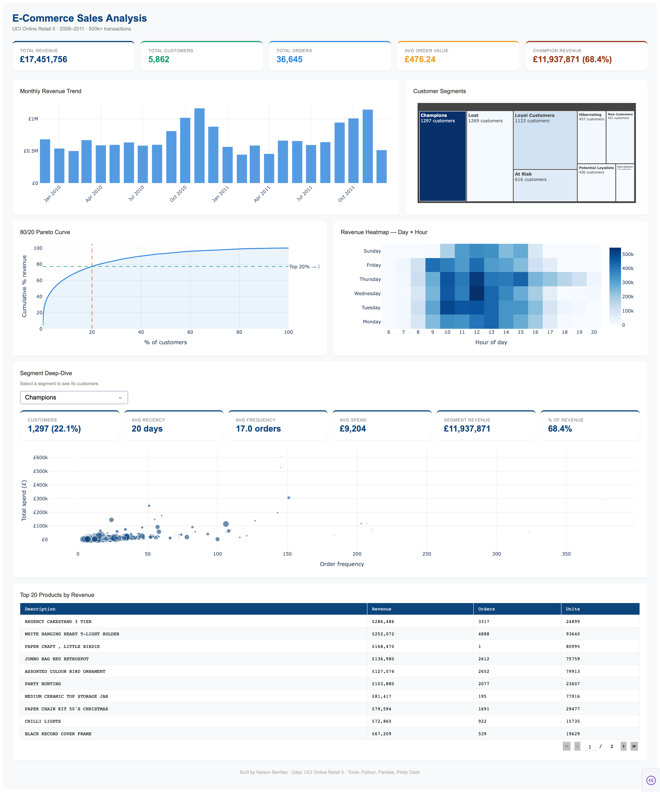

# E-Commerce Sales Analysis & RFM Segmentation


## 📌 Project Overview

End-to-end data analysis of a real UK-based e-commerce retailer using
500,000+ transactions spanning 2009–2011. This project covers the full
analyst workflow: data cleaning, SQL analysis, exploratory data analysis,
RFM customer segmentation, and an interactive dashboard.

**Core business question:**
> Do the top 20% of customers generate the majority of revenue —
> and can we identify who they are?

**Result:**
> ✅ Confirmed — the top 22% of customers (Champions segment)
> generate **68.4% of total revenue** (£11.9M out of £17.4M)

---

## 📊 Dashboard Preview

> 🔗 [Launch Interactive Dashboard](#) ← add your deployed link here later



---

## 🗂️ Project Structure
~~~
ecommerce-sales-analysis/
│
├── data/
│   ├── raw/                        ← original dataset (not modified)
│   ├── online_retail_clean.csv     ← cleaned dataset (750k rows)
│   └── rfm_segments.csv            ← RFM scores and segments per customer
│
├── notebooks/
│   ├── 01_data_cleaning.ipynb      ← load, clean, validate raw data
│   ├── 02_sql_analysis.ipynb       ← SQL queries with window functions
│   ├── 03_eda.ipynb                ← 8 charts covering all dimensions
│   └── 04_rfm_segmentation.ipynb  ← RFM scoring, segments, Pareto validation
│
├── outputs/
│   └── figures/                    ← all saved charts (PNG + HTML)
│
├── app.py                          ← Plotly Dash interactive dashboard
├── requirements.txt
└── README.md

~~~

## 🔍 Dataset

| Property | Detail |
|---|---|
| Source | [UCI Online Retail II](https://archive.ics.uci.edu/dataset/502/online+retail+ii) |
| Transactions | 1,067,371 raw rows |
| After cleaning | ~750,000 rows |
| Unique customers | ~5,900 |
| Unique products | ~4,600 |
| Countries | 40 |
| Date range | December 2009 → December 2011 |

---

## 🛠️ Tools & Technologies

| Tool | Purpose |
|---|---|
| Python 3.11 | Core language |
| Pandas | Data manipulation |
| NumPy | Numerical operations |
| SQLite + SQL | In-notebook database queries |
| Matplotlib / Seaborn | Static charts |
| Plotly | Interactive charts |
| Plotly Dash | Interactive web dashboard |
| Power BI | Corporate-style dashboard |
| Jupyter Notebook | Analysis environment |
| Git / GitHub | Version control & portfolio hosting |

---

## 📁 Notebooks Walkthrough

### 01 — Data Loading & Cleaning
- Combined two Excel sheets (2009–2010 and 2010–2011) into one dataframe
- Removed 317,000+ cancelled orders (invoice codes starting with C)
- Dropped rows with missing Customer IDs (~240k rows)
- Removed internal non-product stock codes (POST, BANK CHARGES, etc.)
- Engineered `revenue` column: `quantity × price`
- **Result:** clean dataset of ~750k rows ready for analysis

### 02 — SQL Analysis
Demonstrated SQL proficiency using SQLite inside Python:
- Revenue by month, country, and product using aggregations
- Window functions: cumulative revenue, % of total, customer ranking
- Day-of-week and hour analysis using `STRFTIME`
- Cancellation rate by country using conditional aggregation
- Average order value and revenue per customer

### 03 — Exploratory Data Analysis
8 charts covering every business dimension:

| Chart | Key Finding |
|---|---|
| Monthly revenue YoY | November peak — holiday season drives 2–3× normal revenue |
| Day × Hour heatmap | Peak activity Tuesday–Thursday, 10 AM–2 PM |
| Pareto — top products | Top 20 products drive ~40% of revenue |
| Purchase frequency | Most customers buy only once — retention is the #1 opportunity |
| Order value boxplot | Heavy right skew from bulk B2B buyers |
| Cohort retention | Month-1 retention ~20–30% — typical for e-commerce |
| Country treemap | UK dominates at ~85% of revenue |
| New vs returning | Returning customers grow steadily through 2011 |

### 04 — RFM Segmentation
- Calculated Recency, Frequency, and Monetary values per customer
- Scored each dimension 1–5 using quintiles
- Assigned 9 business segments based on score combinations
- Validated the 80/20 hypothesis with a Pareto curve

**Segment results:**

| Segment | Customers | % of Revenue |
|---|---|---|
| Champions | 1,297 | 68.4% |
| Loyal Customers | — | — |
| Potential Loyalists | — | — |
| At Risk | — | — |
| Lost | — | — |

> Fill in the remaining rows from your Cell 5 output

---

## 💡 Key Business Insights

1. **Champions drive everything** — 1,297 customers (22% of the base)
   generate £11.9M, or 68.4% of total revenue. Losing even 10% of
   Champions costs £1.2M in annual revenue.

2. **November is critical** — Revenue spikes 2–3× in November driven
   by holiday demand. Inventory and marketing should be planned
   around this window.

3. **Single-purchase customers are the biggest opportunity** — The
   majority of customers buy only once. A structured onboarding
   email sequence targeting New Customers could significantly
   improve retention.

4. **Peak hours are predictable** — Most orders come in Tuesday–Thursday
   between 10 AM and 2 PM. Scheduling promotions and email campaigns
   during these windows would maximize open rates and conversions.

5. **UK dominates but EU is underleveraged** — The UK accounts for ~85%
   of revenue. Germany, France, and the Netherlands show strong AOV —
   targeted EU expansion could be high ROI.

---

## ▶️ How to Run This Project

**1. Clone the repo**
```bash
git clone https://github.com/NelsonBenitez/ecommerce-sales-analysis.git
cd ecommerce-sales-analysis
```

**2. Install dependencies**
```bash
python -m pip install -r requirements.txt
```

**3. Download the dataset**

Download from [UCI Online Retail II](https://archive.ics.uci.edu/dataset/502/online+retail+ii)
and place the `.xlsx` file in `data/raw/`

**4. Run the notebooks in order**

notebooks/01_data_cleaning.ipynb
notebooks/02_sql_analysis.ipynb
notebooks/03_eda.ipynb
notebooks/04_rfm_segmentation.ipynb

**5. Launch the dashboard**
```bash
python app.py
```
Then open `http://127.0.0.1:8050` in your browser.

---

## 📬 Contact

**[Your Name]**
- GitHub: [@NelsonBenitez](https://github.com/NelsonBenitez)
- LinkedIn: www.linkedin.com/in/nelsonbenitezm
- Email: nelson.benitez@udea.edu.co

---

*Dataset source: UCI Machine Learning Repository — Online Retail II.
Used for educational and portfolio purposes.*